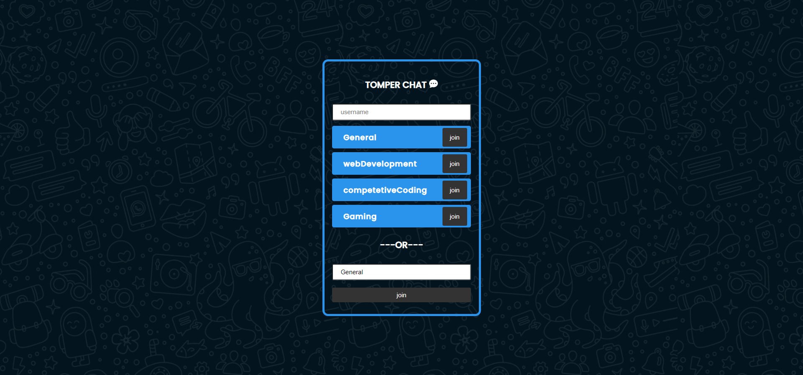
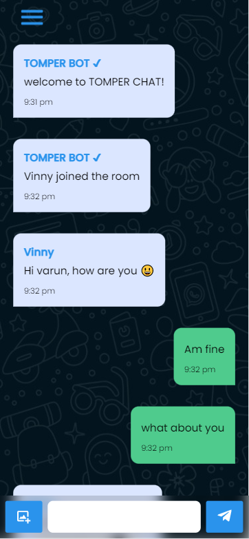
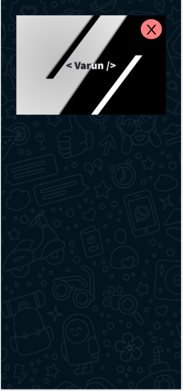
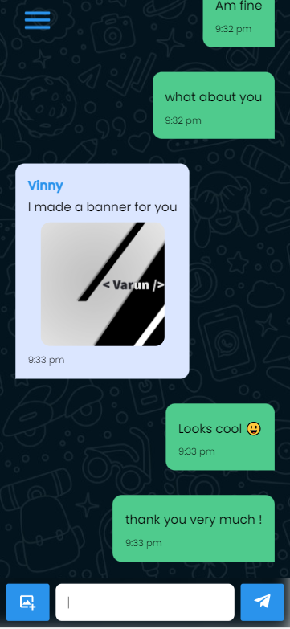

<p align='center'>

</p>
<p align='center'>
<b>A room based chatting application</b>
</p>
<p align='center'>
<a href='https://tomper-chitchat.netlify.app/' target='_blank'>tomper-chitchat.netlify.app</a>
</p>

---

<p align='center'>
This is the frontend of TomperChitChat build with <a href='https://reactjs.org' target='_blank'>react</a> and hosted with <a href='https://app.netlify.com/' target='_blank'>netlify</a>
</p>
<p align='center'>




</p>

#### 🧾 Description

Tomper Chit Chat is a web-based chatting application, allowing users to either chat in public rooms or make their own rooms, by providing a unique room ID. Users can also share images with other room members. Nodejs as the backend, with a React frontend, are used to emit chat messages via socketio.

#### 🛠 Installation and setup

1. Clone the repo to your local machine.
2. Install the required dependency using :

   ```javascript
   npm install
   ```

3. Start the development server using :

   ```javascript
   npm start
   ```

#### 🏎 Creating production built

1. Preview production build :

   ```javascript
   npm run serve
   ```

2. Create a production build using the command :

   ```javascript
   npm run build
   ```

<br>
<br>
<br>

<p align='center'>
(If you liked the project, give it star 😃)
</p>
